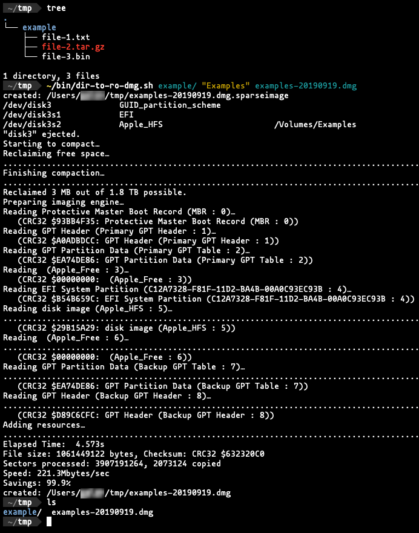
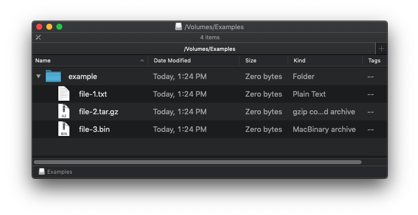

# dir-to-ro-dmg

A bash script to create a read-only DMG containing the contents of a directory. For Mac only.

## Usage

The script requires three arguments:

 - The path to the directory to be processed
 - The volume name (i.e., the name of the volume shown in Finder when mounted)
 - The filename to be given to the created DMG file

## Example of Usage

### Creating the volume

### The volume, when mounted

